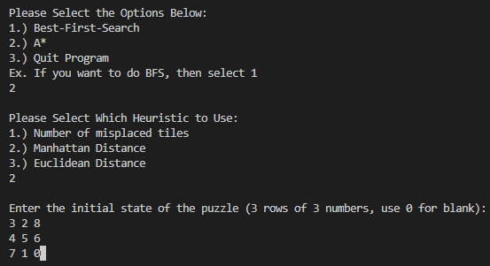
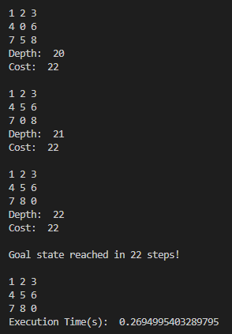

# 8 Puzzle Problem

## Instructions
1. Run the command `python3 8_puzzle.py`
2. It will then prompt the following options from (1, 2, 3):
    - 1: Best-First-Search
    - 2: A* Search
    - 3: Quit Program
3. Then, it will prompt the following options for type heuristics:
    - 1: Number of Misplaced Tiles
    - 2: Total Manhattan Distance
    - 3: Total Euclidean Distance
4. After that, it will prompt the user to enter in the initial state
    - Enter 3 numbers each row and use 0 as blank
    - Example:   
        1 2 0  
        4 5 3  
        7 8 6  
5.  Results would be either:
    - If the initial state and the end state are reachable (both inversions have to be both even or odd)
        - It will display: 
            - the process of moving the puzzle
            - execution time
            - number of steps needed to get to the end goal/state

## Walkthrough Example
### Context: A* search with Manhattan Distance as the Heuristic 
### Initial Setup: 
  
### Process/Result:  
  