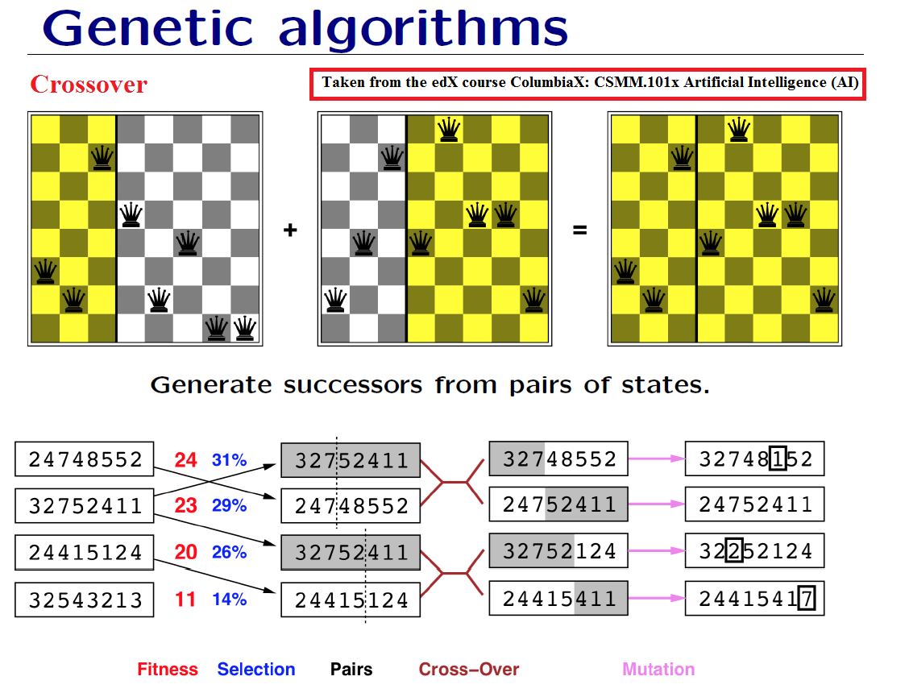

# 8 Queens Problem

## Context
The goal of the 8 queens problem is to place the eight chess queens on an 8x8 chessboard so that no two queens are threatening each other. Two queens cannot be in the same row or diagonal. The 8 queens program will be genetic algorithm in which it will include select probabilities, crossover, and mutate. 

## Process
We would take the initial populations and calculate their fitness and their selection percentage (fitness / total fitness of population). Then, we would perform crossover, where we would randomize (0-7) to determine where we would perform the crossover between two parents. After that, with mutation percentage given by the user, we will use it to determine if the children/successor would have any mutation to perform. In this image, it will give clarity:
    
Then we would repeat the process with a newly generated populations. 

### Calculating Fitness Function
The way we calculate the fitness score (number of non-attacking pairs of queens). The maximum fitness score for this problem is 28 (8 choose 2). To calculate the total score we would take (maximum fitness - total number of clashes).

## Setup
When the user run the program, it will prompt the user a few questions in regards of population size (ex. 100 chessboards with the location of each 8 queens), number of iterations (or number of generations), and the mutation percentage (ex. enter '0.1' for 10%). Then, it will display the first 6 generated initial population (limited the number of displays). Each number in the list indicates which row is the queen at (ex. the range is 0-7, so if it is 6, then the queen is at row 7). We would find the solution if the best fitness score is the maximum (28) or the average fitness is above 27.
